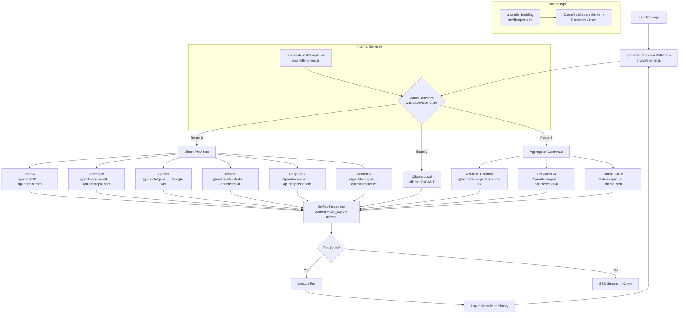

# LLM Architecture — Routes, Providers, SDKs, and Fallback

Authoritative reference for AI Assistant's LLM routing architecture. Covers all routes, service providers, SDKs, where each LLM is used, and the fallback chain order.

> **Last updated:** June 2026 — Post-migration: LiteLLM removed, all providers direct via native SDKs/APIs. Routes 2/3/5 active.

---

## Table of Contents

- [Route Architecture](#route-architecture)
- [Provider Reference Table](#provider-reference-table)
- [Where LLMs Are Used](#where-llms-are-used)
- [Fallback Order](#fallback-order)
- [Architecture Diagram](#architecture-diagram)
- [Key Source Files](#key-source-files)
- [Documentation Audit](#documentation-audit)

---

## Route Architecture

AI Assistant routes all LLM requests through **three independent paths**. Every provider connects directly via its native SDK or API — there is no LiteLLM proxy intermediary.

| Route | Purpose | Providers | Toggle |
|-------|---------|-----------|--------|
| **Route 2** | Direct Providers | OpenAI, Anthropic Claude, Google Gemini, Mistral AI, DeepSeek, Moonshot | `route2Enabled` |
| **Route 3** | Local / Ollama | Ollama (local inference) | `route3Enabled` |
| **Route 5** | Aggregator Gateways | Azure AI Foundry, Fireworks AI, Ollama Cloud | `route5Enabled` |

**Primary route** is configurable via `primaryRoute` (`'route2'` | `'route3'` | `'route5'`). At least one route must be enabled at all times.

### Why Three Routes?

- **Resilience** — cross-route fallback if one provider or gateway fails
- **Provider isolation** — each provider uses its native SDK for reliable tool calling, thinking, and streaming
- **Air-gap support** — Route 3 enables fully offline deployments (Ollama local)
- **Gateway aggregation** — Route 5 groups multi-model gateways (Azure Foundry, Fireworks, Ollama Cloud) for catalog access
- **Compliance** — restrict which provider APIs are reachable from your deployment

### Historical Note

- **Route 1 (LiteLLM proxy)** was removed in June 2026. All providers previously routed through LiteLLM (OpenAI, Gemini, Mistral) now use direct native SDKs.
- **Route 4 (Ollama Cloud)** was folded into Route 5 as an aggregator gateway.
- The system retains backward compatibility with older `RoutesSettings` DB rows that may contain `route1Enabled`; these fields are stripped on read.

---

## Provider Reference Table

### Route 2 — Direct Providers

| Provider | Model Prefixes | SDK / API | API Endpoint | Source File |
|----------|---------------|-----------|-------------|-------------|
| **OpenAI** | `openai/`, `gpt-`, `o1`, `o3`, `o4` | `openai` (native) | `api.openai.com/v1` | [`src/lib/llm/providers/openai.ts`](../../src/lib/llm/providers/openai.ts) |
| **Anthropic** | `anthropic/`, `claude-` | `@anthropic-ai/sdk` | `api.anthropic.com` | Inline in [`src/lib/openai.ts`](../../src/lib/openai.ts) |
| **Google Gemini** | `gemini/`, `gemini-` | `@google/genai` | `generativelanguage.googleapis.com` | [`src/lib/llm/providers/gemini.ts`](../../src/lib/llm/providers/gemini.ts) |
| **Mistral AI** | `mistral/`, `codestral/`, `pixtral/` | `@mistralai/mistralai` | `api.mistral.ai/v1` | [`src/lib/llm/providers/mistral.ts`](../../src/lib/llm/providers/mistral.ts) |
| **DeepSeek** | `deepseek-`, `deepseek/` | OpenAI-compatible | `api.deepseek.com/v1` | Inline in [`src/lib/openai.ts`](../../src/lib/openai.ts) |
| **Moonshot** | `moonshot/` | OpenAI-compatible | `api.moonshot.cn/v1` | Inline in [`src/lib/openai.ts`](../../src/lib/openai.ts) |

### Route 3 — Local / Ollama

| Provider | Model Prefixes | SDK / API | API Endpoint | Source File |
|----------|---------------|-----------|-------------|-------------|
| **Ollama Local** | `ollama-`, `ollama/` | OpenAI SDK → Ollama | `ollama:11434/v1` | Inline in [`src/lib/openai.ts`](../../src/lib/openai.ts) |

### Route 5 — Aggregator Gateways

| Provider | Model Prefixes | SDK / API | API Endpoint | Source File |
|----------|---------------|-----------|-------------|-------------|
| **Azure AI Foundry** | `azure-foundry/` | `@azure/ai-projects` + `@azure/identity` | Configured via `AZURE_FOUNDRY_ENDPOINT` | [`src/lib/llm/providers/azure-foundry.ts`](../../src/lib/llm/providers/azure-foundry.ts) |
| **Fireworks AI** | `fireworks/` | OpenAI-compatible | `api.fireworks.ai/inference/v1` | [`src/lib/llm/providers/fireworks.ts`](../../src/lib/llm/providers/fireworks.ts) |
| **Ollama Cloud** | `ollama-cloud/`, `*-cloud`, `*:cloud` | Native `/api/chat` | `ollama.com/api` | [`src/lib/services/ollama-cloud.ts`](../../src/lib/services/ollama-cloud.ts) |

### Route Classification Logic

Detection functions live in [`src/lib/llm-fallback.ts`](../../src/lib/llm-fallback.ts):

```typescript
// isRoute2Model(model) — matches: anthropic/, claude-, moonshot/,
//   deepseek-, deepseek/, mistral/, codestral/, pixtral/,
//   gemini/, gemini-, openai/, gpt-, o1, o3, o4

// isRoute3Model(model) — matches: ollama-, ollama/

// isRoute5Model(model) — matches: azure-foundry/, fireworks/,
//   ollama-cloud/, *-cloud, *:cloud
```

> **Important:** Route 5 is checked **first** in model filtering (in [`src/app/api/models/route.ts`](../../src/app/api/models/route.ts:16) and [`src/lib/auto-model-selector.ts`](../../src/lib/auto-model-selector.ts:96)) because some models may match multiple route prefixes.

---

## Where LLMs Are Used

### Chat & Tool Calling

| Feature | Dispatch Site | Providers Supported |
|---------|--------------|---------------------|
| **Main Chat + Tools** | [`src/lib/openai.ts`](../../src/lib/openai.ts) — `generateResponseWithTools()` | All Route 2, 3, and 5 providers |
| **Tool Completion** | [`src/lib/openai.ts`](../../src/lib/openai.ts) — `generateToolCompletion()` | All Route 2, 3, and 5 providers |
| **Autonomous Agent** | [`src/lib/agent/llm-router.ts`](../../src/lib/agent/llm-router.ts) | All providers (per-role model selection with Auto) |
| **Subagent** | [`src/lib/agent/executor.ts`](../../src/lib/agent/executor.ts) | Configurable per agent bot version |

### Internal Services

| Service | Dispatch | Purpose |
|---------|----------|---------|
| **Memory Extraction** | [`src/lib/llm-client.ts`](../../src/lib/llm-client.ts) — `createInternalCompletion()` | Extract user facts from conversations |
| **Summarization** | [`src/lib/llm-client.ts`](../../src/lib/llm-client.ts) — `createInternalCompletion()` | Compress long conversations |
| **Prompt Optimization** | [`src/lib/llm-client.ts`](../../src/lib/llm-client.ts) — `createInternalCompletion()` | Refine queries before RAG |
| **Compliance Checking** | [`src/lib/llm-client.ts`](../../src/lib/llm-client.ts) — `createInternalCompletion()` | HITL clarification generation |
| **Diagram Generation** | [`src/lib/diagram-gen/generator.ts`](../../src/lib/diagram-gen/generator.ts) | Generate Mermaid syntax via LLM |
| **Graph Entity Extraction** | [`src/lib/graph/entity-extraction.ts`](../../src/lib/graph/entity-extraction.ts) | Extract entities for FalkorDB |

All internal services route through [`createInternalCompletion()`](src/lib/llm-client.ts:311) which dispatches to the correct native provider based on model prefix — no LiteLLM involved.

### Embeddings

| Provider | Embedding Models | Dimensions | Source File |
|----------|-----------------|------------|-------------|
| **OpenAI** | `text-embedding-3-large`, `text-embedding-3-small` | 3072, 1536 | [`src/lib/llm/providers/openai.ts`](../../src/lib/llm/providers/openai.ts:364) |
| **Mistral** | `mistral-embed` | 1024 | [`src/lib/llm/providers/mistral.ts`](../../src/lib/llm/providers/mistral.ts:243) |
| **Gemini** | `text-embedding-004` | 768 | [`src/lib/llm/providers/gemini.ts`](../../src/lib/llm/providers/gemini.ts:482) |
| **Fireworks** | `nomic-embed-text-v1.5`, `qwen3-embedding-8b` | 768, 4096 | Inline in [`src/lib/openai.ts`](../../src/lib/openai.ts) |
| **Local** | `mxbai-embed-large`, `bge-m3` | 1024, 1024 | [`src/lib/local-embeddings.ts`](../../src/lib/local-embeddings.ts) |

All embeddings dispatch directly via [`createEmbedding()` / `createEmbeddings()`](src/lib/openai.ts:401) — no LiteLLM intermediary. The primary embedding model is configurable in Admin > Settings > RAG. Default: `text-embedding-3-large` (3072d).

> **Warning:** Switching embedding models requires reindexing all documents via Admin > Settings > Reindex. Different models produce incompatible vector dimensions.

### Speech-to-Text (STT) / Transcription

| Provider | Models | SDK | Source File |
|----------|--------|-----|-------------|
| **OpenAI Whisper** | `whisper-1` | OpenAI SDK → Direct | [`src/lib/openai.ts`](../../src/lib/openai.ts) |
| **Google Gemini** | `gemini-2.5-flash` | `@google/genai` | [`src/lib/stt.ts`](../../src/lib/stt.ts) |
| **Mistral Voxtral** | `voxtral-mini` | `@mistralai/mistralai` | [`src/lib/stt.ts`](../../src/lib/stt.ts) |

STT uses direct provider APIs — no LiteLLM proxy involved.

### Text-to-Speech (TTS) / Podcast

| Provider | SDK | Source File |
|----------|-----|-------------|
| **OpenAI TTS** | OpenAI SDK → Direct | [`src/lib/tools/podcast-gen.ts`](../../src/lib/tools/podcast-gen.ts) |
| **Google Gemini TTS** | `@google/genai` | [`src/lib/tools/podcast-gen.ts`](../../src/lib/tools/podcast-gen.ts) |

### Image Generation

| Provider | API | Source File |
|----------|-----|-------------|
| **Gemini Imagen** | REST API / `@google/genai` | [`src/lib/image-gen/providers/gemini-imagen.ts`](../../src/lib/image-gen/providers/gemini-imagen.ts) |

### Translation

| Provider | Source File |
|----------|-------------|
| **OpenAI** | [`src/lib/translation/providers/openai.ts`](../../src/lib/translation/providers/openai.ts) |
| **Gemini** | [`src/lib/translation/providers/gemini.ts`](../../src/lib/translation/providers/gemini.ts) |
| **Mistral** | [`src/lib/translation/providers/mistral.ts`](../../src/lib/translation/providers/mistral.ts) |

All translation providers use direct API calls — no LiteLLM proxy.

---

## Fallback Order

The fallback chain is managed by [`src/lib/llm-fallback.ts`](../../src/lib/llm-fallback.ts) — `withModelFallback()`.

### Priority

1. **Selected model** — User's chosen model (or Auto-selected, or global default)
2. **Universal fallback** — Admin-configured fallback model (if different from selected)
3. **Cross-route fallbacks** — If other routes are enabled, models from those routes are appended:
   - Route 2 fallbacks (hardcoded): `fireworks/minimax-m2p5`, `deepseek-v4-flash`, `moonshot/kimi-k2p5`, `claude-haiku-4-5-20251001`
   - Route 3 fallbacks (dynamic): First available enabled Ollama model
4. **All models exhausted** → `LlmFallbackError` with code `ALL_MODELS_FAILED`

### Capability Gating

Before attempting any model, [`buildModelsToTry()`](src/lib/llm-fallback.ts:280) checks:

- **Vision required?** → Model must be `visionCapable`
- **Tools required?** → Model must be `toolCapable`
- **Model healthy?** → Not in the unhealthy cache (models are marked unhealthy on recoverable errors)

If the selected model doesn't meet requirements, the system switches to the fallback with a `ModelSwitchEvent` recording the reason (`vision_required`, `tools_required`, or `model_unavailable`).

### Health Cache

Models that fail with recoverable errors (rate limits, quotas, auth errors, 5xx) are marked unhealthy for a configurable duration (hourly or daily). They are excluded from the fallback chain until the cache expires.

### Error Classification

Only these error types trigger fallback (from [`isRecoverableApiError()`](src/lib/llm-fallback.ts:130)):

| Category | Triggers |
|----------|----------|
| `rate_limit` | 429, "rate limit", "too many requests" |
| `quota_exceeded` | 402, "quota", "billing", "insufficient_quota" |
| `model_unavailable` | "model not found", "not deployed", "resource not found" |
| `auth_error` | 401, 403, "unauthorized", "invalid api key" |
| `api_error` | 500, 502, 503, 504, "timeout", "service unavailable" |

Local validation errors (schema validation, JSON parse errors) do **not** trigger fallback — they indicate bugs, not provider issues.

---

## Architecture Diagram



### Internal Services Dispatch

```
createInternalCompletion(model, opts)
    │
    ├─ isClaudeModel?     → callAnthropic()           [@anthropic-ai/sdk]
    ├─ isFireworksModel?  → callFireworks()           [OpenAI-compat]
    ├─ isMoonshotModel?   → callMoonshot()            [OpenAI-compat]
    ├─ isDeepSeekModel?   → callDeepSeek()            [OpenAI-compat]
    ├─ isMistralModel?    → callMistralChat()         [@mistralai/mistralai]
    ├─ isGeminiModel?     → callGeminiChat()          [@google/genai]
    ├─ isOpenAIModel?     → callOpenAIChat()          [openai SDK]
    ├─ isOllamaModel?     → callOllama()              [OpenAI SDK → ollama:11434]
    ├─ isOllamaCloud?     → callOllamaCloudDirect()   [Native /api/chat]
    └─ isAzureFoundry?    → callAzureFoundry()        [@azure/ai-projects]
```

---

## Key Source Files

| File | Purpose |
|------|---------|
| [`src/lib/llm-fallback.ts`](../../src/lib/llm-fallback.ts) | Route classification (`isRoute2/3/5Model`), health cache, fallback chain, `withModelFallback()` |
| [`src/lib/openai.ts`](../../src/lib/openai.ts) | Main chat dispatch (`generateResponseWithTools`, `generateToolCompletion`), embeddings (`createEmbedding`), STT |
| [`src/lib/llm-client.ts`](../../src/lib/llm-client.ts) | Internal services dispatch (`createInternalCompletion`) |
| [`src/lib/agent/llm-router.ts`](../../src/lib/agent/llm-router.ts) | Autonomous agent per-role LLM routing |
| [`src/lib/db/config.ts`](../../src/lib/db/config.ts) | `RoutesSettings` interface (route2/3/5 enabled, primaryRoute) |
| [`src/lib/db/compat/config.ts`](../../src/lib/db/compat/config.ts) | Route settings DB read/write with back-compat |
| [`src/app/api/admin/settings/routes/route.ts`](../../src/app/api/admin/settings/routes/route.ts) | Routes settings API endpoint |
| [`src/app/api/models/route.ts`](../../src/app/api/models/route.ts) | Route-aware model filtering for chat dropdown |
| [`src/lib/auto-model-selector.ts`](../../src/lib/auto-model-selector.ts) | Auto model selection with route-aware filtering |
| [`src/lib/llm/providers/openai.ts`](../../src/lib/llm/providers/openai.ts) | OpenAI direct provider (chat, embeddings, detection) |
| [`src/lib/llm/providers/gemini.ts`](../../src/lib/llm/providers/gemini.ts) | Gemini direct provider (chat, embeddings, detection) |
| [`src/lib/llm/providers/mistral.ts`](../../src/lib/llm/providers/mistral.ts) | Mistral direct provider (chat, embeddings, detection) |
| [`src/lib/llm/providers/azure-foundry.ts`](../../src/lib/llm/providers/azure-foundry.ts) | Azure AI Foundry provider (Route 5) |
| [`src/lib/llm/providers/fireworks.ts`](../../src/lib/llm/providers/fireworks.ts) | Fireworks AI provider (Route 5) |
| [`src/lib/services/ollama-cloud.ts`](../../src/lib/services/ollama-cloud.ts) | Ollama Cloud provider (Route 5) |
| [`src/lib/services/model-discovery.ts`](../../src/lib/services/model-discovery.ts) | Provider API model discovery, capability patterns |
| [`src/lib/db/llm-providers.ts`](../../src/lib/db/llm-providers.ts) | Provider CRUD, `DEFAULT_PROVIDERS` |

---

## Configuration

### Environment Variables

| Variable | Provider | Required For |
|----------|----------|-------------|
| `OPENAI_API_KEY` | OpenAI | Chat, embeddings, STT (Whisper), TTS |
| `ANTHROPIC_API_KEY` | Anthropic Claude | Chat, tool calling |
| `GEMINI_API_KEY` | Google Gemini | Chat, embeddings, STT, TTS, image gen, translation |
| `MISTRAL_API_KEY` | Mistral AI | Chat, embeddings, STT (Voxtral), translation, OCR |
| `DEEPSEEK_API_KEY` | DeepSeek | Chat |
| `MOONSHOT_API_KEY` | Moonshot | Chat |
| `FIREWORKS_AI_API_KEY` | Fireworks AI | Chat, embeddings, reranking |
| `AZURE_FOUNDRY_ENDPOINT` | Azure AI Foundry | Endpoint URL (required) |
| `AZURE_FOUNDRY_API_KEY` | Azure AI Foundry | API key (or use `DefaultAzureCredential` with Entra ID) |
| `AZURE_CLIENT_ID` / `AZURE_CLIENT_SECRET` / `AZURE_TENANT_ID` | Azure AI Foundry | Entra ID auth (alternative to API key) |
| `OLLAMA_CLOUD_API_KEY` | Ollama Cloud | Chat |

All keys can also be configured via Admin UI (Settings > LLM > Providers), which takes precedence over environment variables.

### Routes Settings

```typescript
interface RoutesSettings {
  route2Enabled: boolean;   // Route 2: Direct providers (default: true)
  route3Enabled: boolean;   // Route 3: Local / Ollama (default: false)
  route5Enabled: boolean;   // Route 5: Aggregator gateways (default: false)
  primaryRoute: 'route2' | 'route3' | 'route5';  // (default: 'route2')
}
```

Configured via Admin > Settings > Routes or `PUT /api/admin/settings/routes`.

---

## Documentation Audit

The following documents contain stale references to LiteLLM proxy, Route 1, or outdated provider assignments and need updating:

| Document | Status | Notes |
|----------|--------|-------|
| [`docs/tech/liteLLM-implementation-guide.md`](../tech/liteLLM-implementation-guide.md) | **STALE** | Entire document is LiteLLM-centric. Route 1 architecture, YAML config, sync flow. Needs full rewrite or archival. |
| [`docs/tech/SOLUTION.md`](../tech/SOLUTION.md) | **STALE** | "Four-Tier LLM Architecture" diagram (Tier 1 = LiteLLM). "Three-Route Architecture" with Route 1. Tech stack says "via LiteLLM". |
| [`docs/features/routes.md`](routes.md) | **STALE** | Title says "Three-Route". Shows Route 1 (LiteLLM: OpenAI, Gemini, Mistral). No Route 5. Needs rewrite. |
| [`docs/tech/addLLM.md`](../tech/addLLM.md) | **STALE** | Route classification table (Route 1/Route 2). Extensive LiteLLM sync/YAML sections. Missing Azure Foundry provider. |
| [`docs/features/RAG.md`](RAG.md) | **STALE** | "Four-Route Architecture" table with Route 1 and Route 4. |
| [`docs/user_manuals/ADMIN_GUIDE.md`](../user_manuals/ADMIN_GUIDE.md) | **STALE** | Provider grouping by Route 1/Route 2. "Two-route architecture" description. |
| [`docs/features/air-gapped-deployment.md`](air-gapped-deployment.md) | **STALE** | Route 1 referenced in architecture overview. |
| [`docs/developer/issues-known-fix.md`](../developer/issues-known-fix.md) | **STALE** | Tier 1/1b/2/3 breakdown predates current architecture. |
| [`docs/tech/INFRASTRUCTURE.md`](../tech/INFRASTRUCTURE.md) | **STALE** | LiteLLM listed as always-on service, health checks, env vars. |
| [`docs/tech/scaling.md`](../tech/scaling.md) | **STALE** | LiteLLM proxy in scaling architecture. |
| [`docs/tech/fresh-vm-setup.md`](../tech/fresh-vm-setup.md) | **STALE** | LiteLLM setup commands, `OPENAI_BASE_URL` pointing to LiteLLM. |
| [`docs/features/agent-bot.md`](agent-bot.md) | **STALE** | LiteLLM references in known issues. |
| [`docs/INDEX.md`](../INDEX.md) | **STALE** | "Two-Route LLM Architecture" references. Version history entries. |

---

*This document is the authoritative reference for LLM routing. When adding or changing providers/routes, update this document alongside code changes.*
