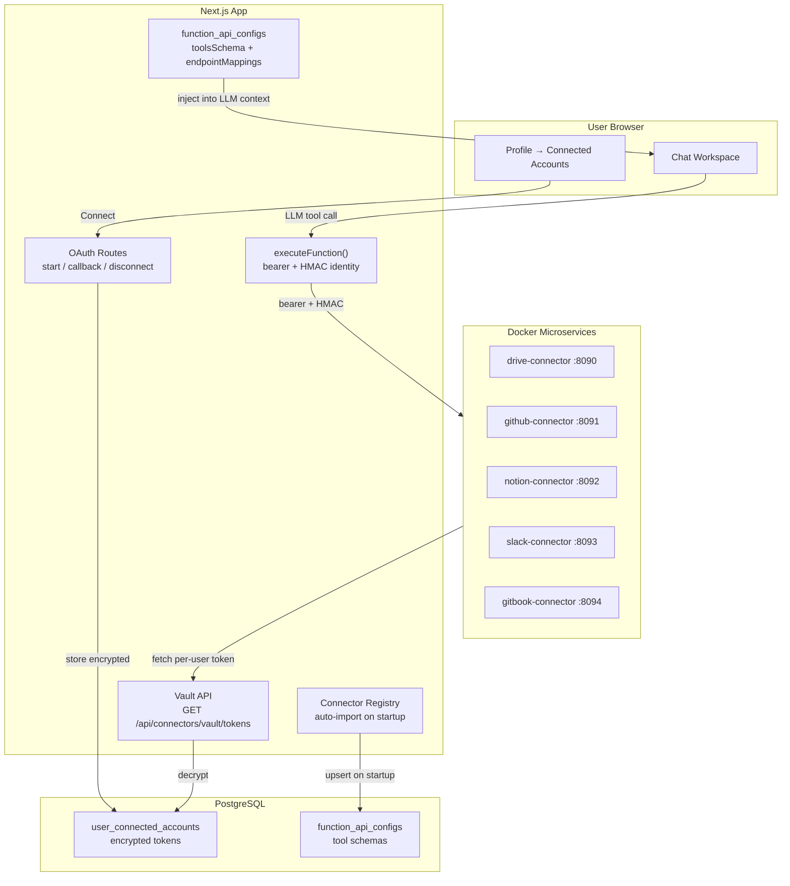

# Connectors

Connect external services (GitHub, Notion, Slack, Google Drive, OneDrive) to
your AI assistant workspaces. Each user authenticates with their own account via
OAuth, and the assistant accesses their data with per-user permissions.

---

## Table of Contents

1. [Overview](#overview)
2. [Supported Connectors](#supported-connectors)
3. [Architecture](#architecture)
4. [Security Model](#security-model)
5. [Token Storage & Encryption](#token-storage--encryption)
6. [Admin Setup](#admin-setup)
7. [User Flow](#user-flow)
8. [Tool Discovery & Auto-Registration](#tool-discovery--auto-registration)
9. [Category Scoping](#category-scoping)
10. [Rate Limiting & Quotas](#rate-limiting--quotas)
11. [Adding a New Connector](#adding-a-new-connector)
12. [Troubleshooting](#troubleshooting)

---

## Overview

Connectors bridge external services into your AI assistant so users can query
their own GitHub repositories, search Notion databases, browse Slack channels,
read Google Drive files, and more — all from within a chat workspace.

Each connector follows a consistent pattern:

```
User connects account (OAuth) → Token stored encrypted →
  Admin assigns connector to categories → Tools appear in chat →
    LLM calls tools → Connector fetches data with user's permissions
```

**Key properties:**
- Per-user OAuth — each user's access is scoped to their own account
- Read-only by default — scopes are minimal and configurable
- Encrypted at rest — all OAuth tokens are AES-256-GCM encrypted
- Auto-discovered — connector tools self-register on startup
- Category-scoped — superusers control which workspaces see which connectors

---

## Supported Connectors

| Connector | Provider | Token Expiry | Tools | Port |
|---|---|---|---|---|
| **Google Drive** | Google OAuth 2.0 | 1 hour (refreshable) | Sheets, Docs, Slides, Drive (35 tools) | 8090 |
| **OneDrive / SharePoint** | Microsoft Entra ID | 1 hour (refreshable) | OneDrive, Excel, Teams, Outlook, SharePoint (35 tools) | 8090 |
| **GitHub** | GitHub OAuth App | Never (revoke only) | Repos, Issues, PRs, Code Search (12 tools) | 8091 |
| **Notion** | Notion OAuth | Never (revoke only) | Pages, Databases, Search, Users (7 tools) | 8092 |
| **Slack** | Slack OAuth | Never (revoke only) | Messages, Channels, Users (5 tools) | 8093 |
| **GitBook** | GitBook OAuth 2.0 | 1 hour (refreshable) | Spaces, Pages, Search, Comments, Users (8 tools) | 8094 |

---

## Architecture



### How a Tool Call Works

1. User sends a message in a workspace assigned to categories with GitHub access
2. LLM sees `github_search_code`, `github_list_repos`, etc. in its tool definitions
3. LLM returns `tool_call: github_search_code(q="auth middleware")`
4. `executeTool("github_search_code", args)` → routes to `functionApiTool.execute()`
5. `executeFunction()` reads `function_api_configs` → finds GitHub Connector config
6. Builds request: `POST http://github-connector:8091/github_search_code` with:
   - `Authorization: Bearer <GITHUB_CONNECTOR_BEARER_TOKEN>` (connector auth)
   - `X-Connector-User-Id: user@example.com` + HMAC signature (identity)
7. GitHub connector verifies HMAC → calls vault → gets user's GitHub token
8. Calls `GET https://api.github.com/search/code?q=...` with user's token
9. Returns results → LLM incorporates into response

---

## Security Model

### Identity Verification

The host app injects signed identity headers on every connector call:

| Header | Value | Purpose |
|---|---|---|
| `X-Connector-User-Id` | User's email | Who is making the request |
| `X-Connector-User-Sig` | HMAC-SHA256(userId, CONNECTOR_HMAC_SECRET) | Prevents spoofing |

The connector verifies the HMAC signature before trusting the identity. This
prevents the LLM from spoofing another user's identity via tool arguments —
the `userId` in the JSON body is stripped when HMAC is configured.

### Token Isolation

- Each user's OAuth tokens are stored in a separate `user_connected_accounts` row
- The vault endpoint verifies HMAC and requires `userId` query param to match the signed header
- Connectors cache tokens in memory only (never persisted to disk)
- Raw tokens are never logged

### Scopes

All connectors request **minimal read-oriented scopes**:

| Connector | Scopes | Access Level |
|---|---|---|
| GitHub | `repo`, `read:org`, `workflow`, `user:email` | Read/write repos, read orgs |
| Notion | Read content, read comments, read user info | Read-only |
| Slack | `channels:read`, `channels:history`, `search:read`, `users:read` | Read-only |
| GitBook | `read:spaces`, `read:content`, `read:comments` | Read-only |
| Google Drive | `drive.file`, `spreadsheets`, `documents`, `presentations` | App-created files + shared |
| OneDrive | `Files.Read`, `Files.ReadWrite`, `Sites.Read.All` | Read/write user files |

### Disconnect & Revocation

When a user disconnects:
1. GitHub/Slack: token is revoked at the provider via API call
2. Notion: no revocation endpoint — local record deleted (token still valid at Notion, user must revoke manually)
3. Google/Microsoft: refresh token is revoked
4. Local DB row is deleted regardless of revocation outcome

---

## Token Storage & Encryption

### At Rest

All OAuth tokens are encrypted using AES-256-GCM before storage in PostgreSQL:

```
user_connected_accounts
├── access_token   → ENCRYPTED (AES-256-GCM)
├── refresh_token  → ENCRYPTED (AES-256-GCM)
├── scopes         → PLAINTEXT (space-delimited)
├── token_expiry   → PLAINTEXT (ISO 8601 timestamp or NULL)
└── revoked        → PLAINTEXT (boolean)
```

Encryption uses `DATA_SOURCE_ENCRYPTION_KEY` from environment. Tokens are
decrypted only when fetched by the vault endpoint for connector use.

### In Transit

- OAuth token exchange: HTTPS to provider (GitHub, Notion, Slack)
- Vault endpoint: internal Docker network (http://app:3000 → connector container)
- Connector ↔ Provider API: HTTPS

### In Memory

- Connectors cache decrypted access tokens in a `Map<string, Token>` with TTL
- GitHub/Notion/Slack tokens (never expire): cached for 24 hours
- Google/Microsoft tokens (1h expiry): cached until 60s before expiry
- Negative cache (no connected account): 30 seconds

---

## Admin Setup

### 1. Register OAuth Apps

For each connector you want to enable, register an OAuth application:

| Connector | Registration URL | Callback URL |
|---|---|---|
| GitHub | https://github.com/settings/developers | `{NEXTAUTH_URL}/api/connectors/github/callback` |
| Notion | https://www.notion.so/my-integrations | `{NEXTAUTH_URL}/api/connectors/notion/callback` |
| Slack | https://api.slack.com/apps | `{NEXTAUTH_URL}/api/connectors/slack/callback` |
| GitBook | https://app.gitbook.com/account/developer | `{NEXTAUTH_URL}/api/connectors/gitbook/callback` |
| Google | https://console.cloud.google.com/apis/credentials | `{NEXTAUTH_URL}/api/connectors/google/callback` |
| Microsoft | Azure Portal → App registrations | `{NEXTAUTH_URL}/api/connectors/microsoft/callback` |

### 2. Configure Environment Variables

```bash
# Required for each connector you enable:
GITHUB_CLIENT_ID=your_github_client_id
GITHUB_CLIENT_SECRET=your_github_client_secret
GITHUB_CONNECTOR_BEARER_TOKEN=$(openssl rand -hex 32)

NOTION_CLIENT_ID=your_notion_client_id
NOTION_CLIENT_SECRET=your_notion_client_secret
NOTION_CONNECTOR_BEARER_TOKEN=$(openssl rand -hex 32)

SLACK_CLIENT_ID=your_slack_client_id
SLACK_CLIENT_SECRET=your_slack_client_secret
SLACK_CONNECTOR_BEARER_TOKEN=$(openssl rand -hex 32)

# Shared across all connectors:
CONNECTOR_HMAC_SECRET=$(openssl rand -hex 32)
DATA_SOURCE_ENCRYPTION_KEY=$(openssl rand -hex 32)
```

### 3. Enable Docker Profiles

New connectors use Docker Compose profiles. Add to `COMPOSE_PROFILES`:

```bash
# Enable specific connectors:
COMPOSE_PROFILES=postgres,qdrant,github,notion,slack

# Or enable all:
COMPOSE_PROFILES=postgres,qdrant,github,notion,slack
```

### 4. Assign Categories

After `make up`, go to **Admin → Function APIs**. Each connector auto-registers
as a Function API config (e.g., "GitHub Connector"). Assign it to the categories
(workspaces) where you want those tools available.

---

## User Flow

### Connecting an Account

1. Go to **Profile** (click avatar → Profile)
2. Scroll to **Connected Accounts** section
3. Click **Connect** next to the service you want to link
4. You'll be redirected to the provider's OAuth consent screen
5. Review the requested permissions → **Authorize**
6. Redirected back to Profile with a success message
7. The service now shows as **Connected** with your account name

### Using in Chat

1. Open a workspace that has connector tools assigned
2. Ask questions naturally — the LLM will use connector tools when relevant:
   - "Find open issues labeled 'bug' in my backend repo"
   - "Search my Notion for meeting notes from last week"
   - "What did the team discuss in #general channel yesterday?"
3. The assistant calls the appropriate tools and includes results in its response

### Disconnecting

1. Go to **Profile → Connected Accounts**
2. Click **Disconnect** next to the service
3. The OAuth token is revoked at the provider and deleted locally

---

## Tool Discovery & Auto-Registration

Connector tools are automatically discovered and registered at app startup:

1. `initializeTools()` in [`src/lib/tools.ts`](../src/lib/tools.ts) calls `syncConnectorTools()`
2. For each provider in [`src/lib/connectors/provider-meta.ts`](../src/lib/connectors/provider-meta.ts):
   - Pings `GET /health` on the connector container
   - If healthy, fetches `GET /tools` to get OpenAI function schemas
   - Builds `endpointMappings` automatically from tool names
   - Upserts a `function_api_configs` row with `toolsSchema` and credentials
3. Tools appear in the LLM's function definitions for assigned categories

**No manual import needed.** The admin only needs to assign categories.

---

## Category Scoping

Connector tools are scoped to workspace categories via the `function_api_categories`
join table. A superuser can:

1. Go to **Admin → Function APIs**
2. Select a connector config (e.g., "GitHub Connector")
3. Assign it to specific categories
4. Only users in those categories see the connector's tools

This allows:
- An "Engineering" category to have GitHub + Slack tools
- A "Research" category to have Notion + Google Drive tools
- A "Management" category to have all connectors

---

## Rate Limiting & Quotas

### Per-User Rate Limits

Since each user connects their own account, rate limits are **per-user** (not shared):

| Connector | Rate Limit | Scope |
|---|---|---|
| GitHub | 5,000 req/hour (authenticated) | Per user token |
| Notion | 3 req/second | Per integration |
| Slack | Tiered by workspace plan | Per workspace |
| GitBook | 100 req/minute | Per OAuth app |
| Google Drive | 12,000 req/minute (per user) | Per user token |
| Microsoft Graph | 10,000 req/minute | Per app + user |

This is a significant advantage over shared API keys — one user's heavy usage
does not affect others.

### Connector Timeouts

All connectors have a 30-second default timeout for API calls. This is
configurable via `*_TIMEOUT_MS` env vars.

---

## Adding a New Connector

The connector framework is designed for rapid addition of new services.
See [`services/_connector-template/`](../../services/_connector-template/) for
the reusable scaffolding.

### Steps

1. Copy the template:
   ```bash
   cp -r services/_connector-template services/my-service-connector
   ```

2. Customize:
   - `package.json` → update `name`
   - `src/config.ts` → add service-specific env vars
   - `src/tools.ts` → define 5-12 curated `ToolDef[]` operations
   - `src/ops.ts` → implement each tool calling the external API
   - `src/ops.ts` → set `PROVIDER` constant and add to `VaultProvider` union
   - `src/vault.ts` → add provider to `VaultProvider` union

3. Register in the host app:
   - Add provider to `ConnectedAccountProvider` in [`src/types/connected-accounts.ts`](../../src/types/connected-accounts.ts)
   - Add OAuth routes: `src/app/api/connectors/{provider}/start|c|disconnect/route.ts`
   - Add entry to `CONNECTOR_PROVIDERS` in [`src/lib/connectors/provider-meta.ts`](../../src/lib/connectors/provider-meta.ts)
   - Add to DB constraint in [`src/lib/db/kysely.ts`](../../src/lib/db/kysely.ts)
   - Add to `VALID_PROVIDERS` in [`src/app/api/connectors/vault/tokens/route.ts`](../../src/app/api/connectors/vault/tokens/route.ts)

4. Add Docker Compose service with a profile.

### Files That Never Change

| File | Reason |
|---|---|
| `src/http.ts` | Generic HTTP client — works for any REST API |
| `src/logger.ts` | Structured JSON logger |
| `src/server.ts` | Generic HTTP server with OP_HANDLERS dispatch |

---

## Troubleshooting

### Connector shows "Not connected" but I authorized it

Check server logs: `docker logs policy-bot-app | grep connector`

Common causes:
- `*_CLIENT_ID` / `*_CLIENT_SECRET` not set in `.env`
- Callback URL mismatch between `.env` (`NEXTAUTH_URL`) and OAuth App registration
- DB CHECK constraint failure (provider not in allowed list) — restart after updating `kysely.ts`

### "Connector health check failed" in logs

The connector container isn't running. Check:
- `COMPOSE_PROFILES` includes the connector (e.g., `github`)
- `*_CONNECTOR_BEARER_TOKEN` is set (min 16 chars)
- Container logs: `docker logs policy-bot-github-connector`

### Tools don't appear in chat

1. Verify connector is healthy: `curl http://github-connector:8091/health`
2. Check if `function_api_configs` row exists with correct tools
3. Ensure the workspace's categories are assigned to the connector in Admin → Function APIs

### "RECONNECT_REQUIRED" error in chat

The stored OAuth token is invalid. User should:
1. Go to Profile → Connected Accounts
2. Disconnect the service
3. Reconnect (triggers fresh OAuth flow)
