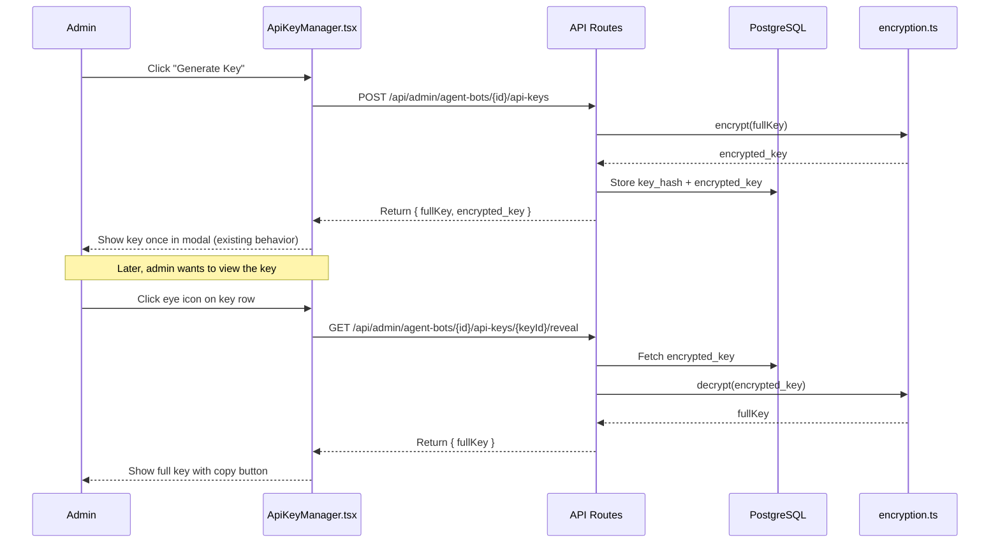

# Agent Bot API Key Reveal for Admins

## Goal

Allow admin users to view and copy the full agent-bot API key after creation by clicking an eye icon in the key list, rather than seeing it only once at generation time.

---

## Background / Current State

### How API keys are stored today

When an API key is created in [`src/lib/db/compat/agent-bot-api-keys.ts`](src/lib/db/compat/agent-bot-api-keys.ts), the flow is:

1. Generate a random full key: `ab_pk_<48-char-random>`
2. Hash the key with **SHA-256** → store only the hash in `key_hash`
3. Store the prefix (first 12 chars) in `key_prefix` for display
4. Return the full key **once** in the creation response

The database schema ([`src/lib/db/schema/postgres.sql`](src/lib/db/schema/postgres.sql:981)):

```sql
CREATE TABLE IF NOT EXISTS agent_bot_api_keys (
  id TEXT PRIMARY KEY,
  agent_bot_id TEXT NOT NULL,
  name TEXT NOT NULL,
  key_prefix TEXT NOT NULL,
  key_hash TEXT NOT NULL,       -- SHA-256 hash, NOT reversible
  permissions TEXT NOT NULL DEFAULT '["invoke"]',
  rate_limit_rpm INTEGER DEFAULT 60,
  rate_limit_rpd INTEGER DEFAULT 1000,
  expires_at TIMESTAMP,
  last_used_at TIMESTAMP,
  is_active INTEGER DEFAULT 1,
  created_by TEXT NOT NULL,
  created_at TIMESTAMP DEFAULT NOW(),
  revoked_at TIMESTAMP,
  FOREIGN KEY (agent_bot_id) REFERENCES agent_bots(id) ON DELETE CASCADE
);
```

### What the UI shows today

**The key list** ([`ApiKeyManager.tsx`](src/components/admin/agent-bots/ApiKeyManager.tsx:271)) shows only the prefix:
```
ab_pk_a1b2c3d4...
```

**After key creation**, a modal displays the full key once with a warning:
> "Copy this key now. You won't be able to see it again!"

### The problem

Since only the SHA-256 hash is stored, **it is cryptographically impossible to recover the original key after creation**. The existing approach is intentionally secure — but prevents admins from retrieving a key they may have forgotten to copy.

---

## Proposed Solution

### Overview

Reuse the existing [`DATA_SOURCE_ENCRYPTION_KEY`](src/lib/encryption.ts) AES-256-GCM encryption (already used for LLM provider keys and data source credentials) to store an **encrypted copy** of the full key alongside the hash. Add a privileged admin-only endpoint to decrypt and reveal it.

### Flow Diagram



### Files to Modify

| # | File | Change |
|---|------|--------|
| 1 | [`src/lib/db/schema/postgres.sql`](src/lib/db/schema/postgres.sql:981) | Add `encrypted_key TEXT` column |
| 2 | [`src/types/agent-bot.ts`](src/types/agent-bot.ts) | Add `encrypted_key` to `AgentBotApiKey` type, add `RevealedApiKey` response type |
| 3 | [`src/lib/db/compat/agent-bot-api-keys.ts`](src/lib/db/compat/agent-bot-api-keys.ts) | Modify `createApiKey` to encrypt + store full key; add `getRevealedApiKey()` |
| 4 | [`src/lib/db/agent-bot-api-keys.ts`](src/lib/db/agent-bot-api-keys.ts) | Mirror changes in sync version (if used anywhere besides compat) |
| 5 | [`src/app/api/admin/agent-bots/[id]/api-keys/[keyId]/route.ts`](src/app/api/admin/agent-bots/[id]/api-keys/[keyId]/route.ts) | Add `GET` handler for key reveal |
| 6 | [`src/components/admin/agent-bots/ApiKeyManager.tsx`](src/components/admin/agent-bots/ApiKeyManager.tsx) | Add eye icon toggle, reveal state, copy button per key row |
| 7 | [`src/lib/db/compat/index.ts`](src/lib/db/compat/index.ts) | Export the new `getRevealedApiKey` function |

---

## Detailed Implementation Steps

### Step 1 — Add `encrypted_key` column to DB schema

In [`src/lib/db/schema/postgres.sql`](src/lib/db/schema/postgres.sql:981), add the column to the `CREATE TABLE`:

```sql
encrypted_key TEXT,  -- AES-256-GCM encrypted full key (iv:authTag:ciphertext)
```

And add a migration SQL to add the column to existing databases:

```sql
ALTER TABLE agent_bot_api_keys ADD COLUMN IF NOT EXISTS encrypted_key TEXT;
```

### Step 2 — Update types

In [`src/types/agent-bot.ts`](src/types/agent-bot.ts):

1. Add `encrypted_key?: string` to `AgentBotApiKey` interface (optional since old records won't have it)
2. Add `RevealedApiKeyResponse` type:

```typescript
export interface RevealedApiKeyResponse {
  id: string;
  name: string;
  fullKey: string;
}
```

### Step 3 — Update `createApiKey` to store encrypted key

In [`src/lib/db/compat/agent-bot-api-keys.ts`](src/lib/db/compat/agent-bot-api-keys.ts), modify [`createApiKey()`](src/lib/db/compat/agent-bot-api-keys.ts:147):

1. Import `encrypt` from `@/lib/encryption`
2. After generating `fullKey`, encrypt it:
   ```typescript
   import { encrypt } from '@/lib/encryption';
   const encryptedKey = encrypt(fullKey);
   ```
3. Store `encryptedKey` in the `encrypted_key` column in the INSERT

> **Note**: If `DATA_SOURCE_ENCRYPTION_KEY` is not configured, the `encrypt()` function will throw. This is acceptable — the admin should configure encryption before generating keys they want to be able to reveal. The CREATE modal should still work (showing the key once), but the reveal feature will surface the error gracefully.

Also update [`src/lib/db/agent-bot-api-keys.ts`](src/lib/db/agent-bot-api-keys.ts) (the sync version) with the same logic, if it's still in active use.

### Step 4 — Add `getRevealedApiKey` compat function

In [`src/lib/db/compat/agent-bot-api-keys.ts`](src/lib/db/compat/agent-bot-api-keys.ts), add:

```typescript
import { encrypt, decrypt, isEncryptionConfigured } from '@/lib/encryption';

export async function getRevealedApiKey(
  keyId: string,
  agentBotId: string
): Promise<{ fullKey: string } | { error: string; code: string }> {
  if (!isEncryptionConfigured()) {
    return { error: 'Encryption is not configured. Set DATA_SOURCE_ENCRYPTION_KEY.', code: 'ENCRYPTION_NOT_CONFIGURED' };
  }

  const apiKey = await getApiKeyById(keyId);
  if (!apiKey || apiKey.agent_bot_id !== agentBotId) {
    return { error: 'API key not found', code: 'NOT_FOUND' };
  }
  if (!apiKey.encrypted_key) {
    return { error: 'This key was created before encryption support was added and cannot be revealed', code: 'NOT_ENCRYPTED' };
  }

  try {
    const fullKey = decrypt(apiKey.encrypted_key);
    return { fullKey };
  } catch {
    return { error: 'Failed to decrypt API key', code: 'DECRYPT_FAILED' };
  }
}
```

### Step 5 — Add reveal API endpoint

Modify [`src/app/api/admin/agent-bots/[id]/api-keys/[keyId]/route.ts`](src/app/api/admin/agent-bots/[id]/api-keys/[keyId]/route.ts) to add a `GET` handler:

```typescript
export async function GET(
  request: NextRequest,
  { params }: { params: Promise<{ id: string; keyId: string }> }
): Promise<NextResponse> {
  try {
    await requireElevated();
    const { id, keyId } = await params;

    const result = await getRevealedApiKey(keyId, id);

    if ('error' in result) {
      const status = result.code === 'NOT_FOUND' ? 404 : 400;
      return NextResponse.json({ error: result.error, code: result.code }, { status });
    }

    return NextResponse.json({ fullKey: result.fullKey });
  } catch (error) {
    if (error instanceof Error && error.message.includes('access required')) {
      return NextResponse.json({ error: error.message }, { status: 403 });
    }
    console.error('[Admin] Error revealing API key:', error);
    return NextResponse.json({ error: 'Failed to reveal API key' }, { status: 500 });
  }
}
```

### Step 6 — Update UI with eye icon + reveal + copy

In [`ApiKeyManager.tsx`](src/components/admin/agent-bots/ApiKeyManager.tsx):

**State additions:**
```typescript
// Per-key reveal state: key id -> revealed full key or null
const [revealedKeys, setRevealedKeys] = useState<Record<string, string>>({});
const [revealingKey, setRevealingKey] = useState<string | null>(null);
const [revealErrors, setRevealErrors] = useState<Record<string, string>>({});
```

**Reveal handler:**
```typescript
const handleRevealKey = async (keyId: string) => {
  // If already revealed, hide it (toggle off)
  if (revealedKeys[keyId]) {
    setRevealedKeys(prev => {
      const next = { ...prev };
      delete next[keyId];
      return next;
    });
    return;
  }

  setRevealingKey(keyId);
  setRevealErrors(prev => { const n = {...prev}; delete n[keyId]; return n; });

  try {
    const response = await fetch(
      `/api/admin/agent-bots/${agentBotId}/api-keys/${keyId}`
    );
    if (!response.ok) {
      const data = await response.json();
      throw new Error(data.error || 'Failed to reveal key');
    }
    const data = await response.json();
    setRevealedKeys(prev => ({ ...prev, [keyId]: data.fullKey }));
  } catch (err) {
    setRevealErrors(prev => ({
      ...prev,
      [keyId]: err instanceof Error ? err.message : 'Failed to reveal key',
    }));
  } finally {
    setRevealingKey(null);
  }
};
```

**UI changes in key row** ([lines 258-303](src/components/admin/agent-bots/ApiKeyManager.tsx:258)):

Replace the current prefix-only display with:

```
┌──────────────────────────────────────────────┐
│ 🔑 Key Name                     [👁️] [🗑️]   │
│    ab_pk_a1b2c3d4...                         │  ← collapsed by default
│    ─── or when revealed ───                  │
│    ab_pk_a1b2c3d4e5f6g7h8i9j0...  [📋 Copy] │  ← revealed on eye click
│    60/min, 1000/day  Last used: 2h ago       │
└──────────────────────────────────────────────┘
```

The eye icon should:
- Show `👁️` (Eye icon from `lucide-react`) when key is hidden
- Show `👁️‍🗨️` (EyeOff icon) when key is revealed
- Toggle between show/hide on click
- When showing, display the full key in a monospace font with a copy button next to it
- The copy button copies just the key (not the cURL command)

**Copy behavior:**
- When a revealed key is visible, provide a Copy icon that copies only the full key value
- Show a brief "Copied!" checkmark feedback

**Error handling:**
- If encryption is not configured, show a warning badge and disable the eye icon with a tooltip

---

## Security Considerations

1. **Encryption at rest**: The encrypted key is stored with AES-256-GCM using `DATA_SOURCE_ENCRYPTION_KEY` — the same encryption already used for LLM provider keys and data source credentials. This is a proven pattern in the codebase.

2. **Audit trail**: The existing `last_used_at` timestamp is automatically updated on each API call. We could optionally add a `revealed_at` or audit log for key reveal events.

3. **Admin-only**: The reveal endpoint uses [`requireElevated()`](src/lib/auth.ts) which requires admin or superuser role. Only admins (not superusers) have access to the agent-bot management UI per the route structure.

4. **Existing keys**: Keys created before this change won't have `encrypted_key`. The UI gracefully handles this by showing an error message and disabling the eye icon.

5. **No plaintext in transit**: The API returns the key over HTTPS. The frontend stores it only in React state (not in localStorage or cookies).

---

## Open Questions for Discussion

1. Should we add a separate audit log entry when a key is revealed (e.g., log to `agent_bot_api_key_events` table)?
2. Should revealed keys auto-hide after a timeout (e.g., 30 seconds)?
3. Should superusers (non-admin elevated users) also have access to reveal keys for agent bots in their categories?
